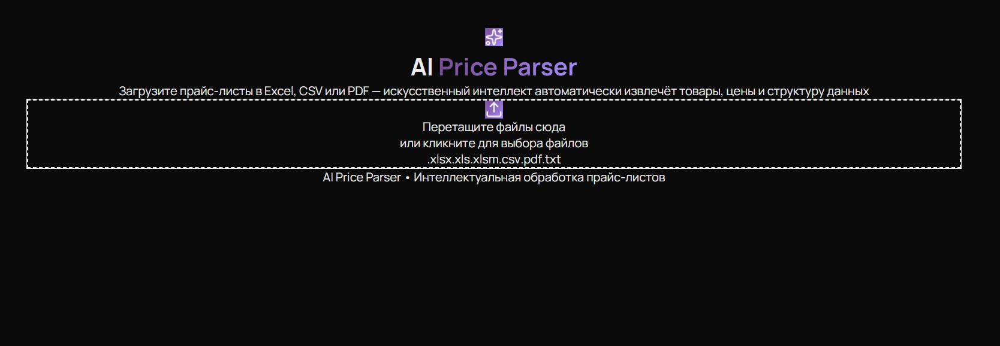
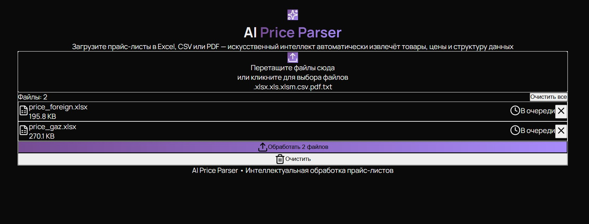
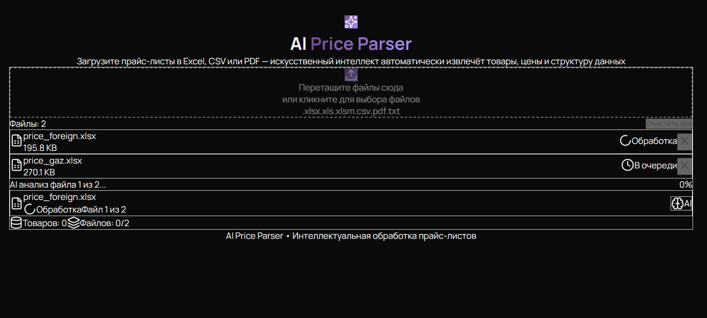
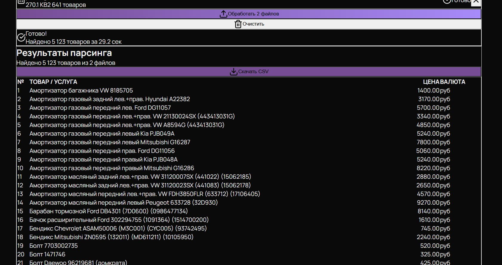

# 🤖 AI Price Parser

<div align="center">
  
  
  
  
  <br/>
  
  
</div>

<p align="center">
  <strong>Интеллектуальный парсер прайс-листов с использованием AI</strong>
</p>

---

## 📸 Демо

<table>
  <tr>
    <td></td>
    <td></td>
  </tr>
  <tr>
    <td align="center"><b>Главная страница</b></td>
    <td align="center"><b>Загрузка файлов</b></td>
  </tr>
  <tr>
    <td></td>
    <td></td>
  </tr>
  <tr>
    <td align="center"><b>Обработка AI</b></td>
    <td align="center"><b>Результаты парсинга</b></td>
  </tr>
</table>

---

## ✨ Возможности

- 🚀 **Автоматическое распознавание структуры** — AI сам определяет, где название, где цена
- 📊 **Поддержка любых форматов** — Excel (.xlsx, .xls, .xlsm), CSV, PDF, TXT
- 🧠 **Локальный AI** — работает на Ollama, не требует интернета
- ⚡ **Высокая скорость** — обработка 1000+ товаров за секунды
- 🎨 **Современный интерфейс** — тёмная тема, drag-and-drop, прогресс в реальном времени
- 📥 **Экспорт в CSV** — одним кликом
- 🔄 **Пакетная обработка** — загружайте несколько файлов одновременно

---

## 🚀 Быстрый старт с демо-файлами

В папке [`docs/demo-files/`](docs/demo-files/) лежат готовые прайс-листы для тестирования:

1. **price_autoparts.csv** — автозапчасти
2. **price_medical.csv** — медицинские услуги
3. **price_simple.csv** — простой прайс

```bash
# Загрузи любой из них через интерфейс и посмотри, как AI парсит данные
📦 Установка
Требования
Go 1.22+

Node.js 20+

Docker & Docker Compose

NVIDIA GPU (опционально)

Быстрый старт
bash
# 1. Клонирование
git clone https://github.com/dmironovru/price-parser.git
cd price-parser

# 2. Установка зависимостей
make install

# 3. Запуск в режиме разработки
make dev
Откройте: http://localhost:3000

🛠️ Команды управления
Команда	Описание
make dev	Режим разработки (горячая перезагрузка)
make build	Сборка продакшен версии
make start	Запуск продакшен версии
make stop	Остановка всех сервисов
make clean	Очистка сборок
make install	Установка зависимостей
make deploy	Полный деплой
🏗️ Архитектура
text
┌─────────────────────────────────────────────────────────┐
│                    Next.js 15 Frontend                   │
│              (Shadcn UI, Drag-and-Drop)                 │
└───────────────────────────┬─────────────────────────────┘
                            │ HTTP / WebSocket
                            ▼
┌─────────────────────────────────────────────────────────┐
│                     Go Backend (Fiber)                   │
│                 (API, Validation, Workers)              │
└───────┬──────────┬──────────┬──────────┬───────────────┘
        │          │          │          │
        ▼          ▼          ▼          ▼
┌───────────┐ ┌──────────┐ ┌──────────┐ ┌──────────┐
│PostgreSQL │ │  Redis   │ │MinIO (S3)│ │Meilisearch│
│ + pgvector│ │ (Queue)  │ │  Files   │ │  Search   │
└───────────┘ └──────────┘ └──────────┘ └──────────┘
        │          │
        ▼          ▼
┌─────────────────────────────────────────────────────────┐
│                    AI Worker (Ollama)                    │
│                   (GPU Accelerated)                     │
└─────────────────────────────────────────────────────────┘
📁 Структура проекта
text
price-parser/
├── backend/          # Go бэкенд
├── frontend/         # Next.js фронтенд
├── docs/
│   ├── screenshots/  # Скриншоты
│   └── demo-files/   # Демо-файлы
├── infra/            # Docker и конфиги
├── scripts/          # Скрипты запуска
├── Makefile
└── README.md
🔧 Переменные окружения
Создайте .env:

env
PORT=8080
POSTGRES_HOST=postgres
POSTGRES_USER=parser
POSTGRES_PASSWORD=parser_pass
POSTGRES_DB=price_parser
REDIS_HOST=redis
OLLAMA_HOST=http://localhost:11434


<p align="center"> Made with ❤️ by <a href="https://dmitrymironov.ru">Dmitry Mironov</a> </p>