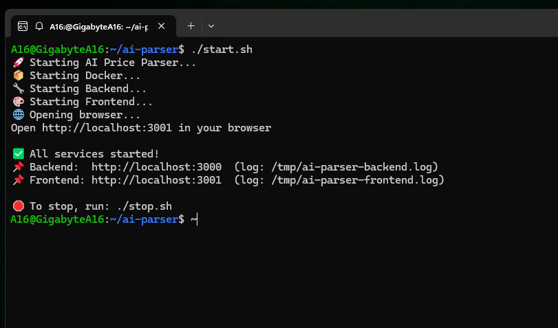
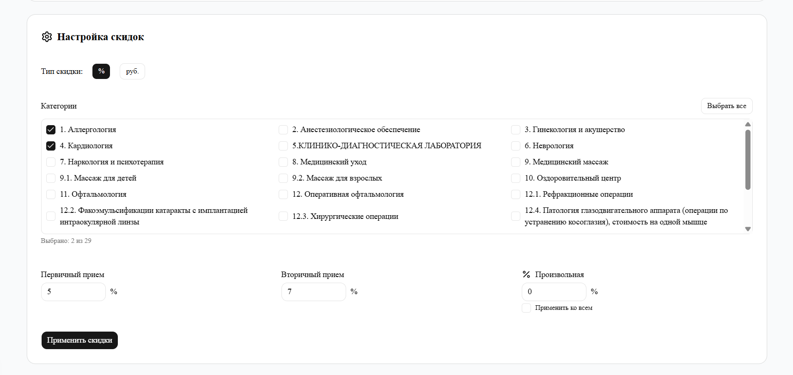
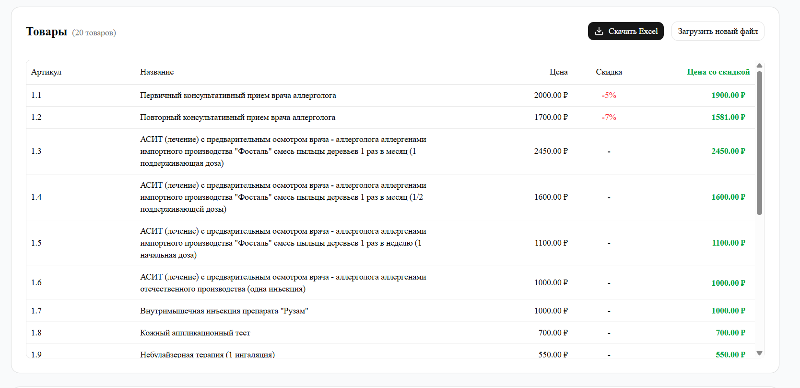
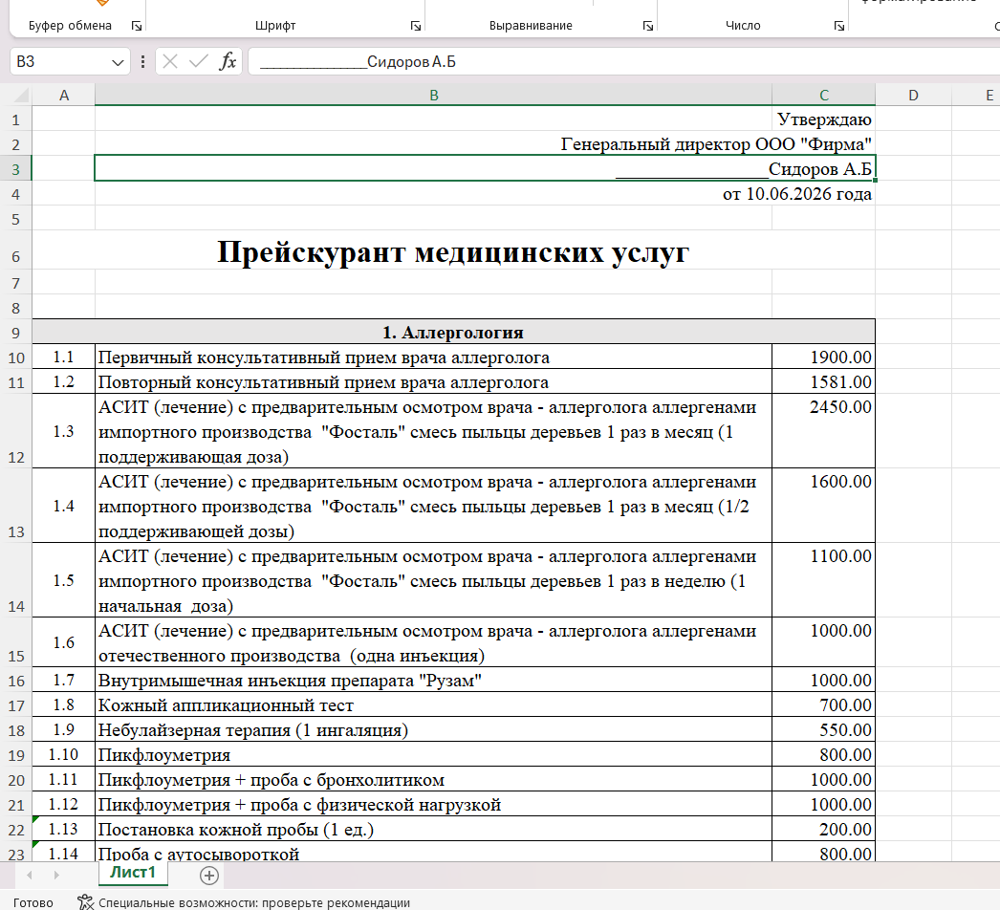

# 🧾 AI Price Parser — Умный редактор прайс-листов

**AI Price Parser** — это веб-приложение для массового и точечного редактирования цен в Excel-прайсах.  
Оно автоматически определяет структуру файла, позволяет применять скидки в процентах или рублях, редактировать отдельные строки и сохранять результат в исходном формате.

---

## 🚀 Возможности

- **Загрузка Excel-файлов** (.xlsx)
- **Автоматическое определение категорий** (по структуре прайса)
- **Массовое применение скидок**:
  - В процентах (%)
  - В рублях (фиксированная сумма)
- **Применение скидок по категориям** (выборочно)
- **Точечное редактирование цен** (клик по ячейке)
- **Сохранение ручных правок** (не сбрасываются при пересчёте)
- **Экспорт результата** в Excel с сохранением исходной структуры

---

## 🛠️ Технологии

| Компонент | Технология |
|-----------|------------|
| **Backend** | Go + Fiber |
| **Frontend** | Next.js 15 + React + Tailwind + shadcn/ui |
| **Обработка Excel** | Библиотека excelize |

> ⚡ Проект работает без Docker, PostgreSQL и Redis — все данные обрабатываются в памяти и сохраняются в Excel-файл.

---

## 📸 Скриншоты

### 0. Запуск через терминал

Для запуска проекта используется один терминал: команда `./start.sh` запускает все сервисы в фоне, а `./stop.sh` — останавливает. Логи пишутся в `/tmp/ai-parser-*.log`.

---

### 1. Загрузка файла

На этой странице пользователь загружает Excel-файл с прайс-листом. Поддерживаются файлы с произвольной структурой (категории, подкатегории, ценовые колонки).

---

### 2. Настройка скидок

На экране настройки пользователь выбирает:
- **Тип скидки** (% или ₽)
- **Категории**, к которым применить скидку
- **Первичный / Вторичный / Произвольный** тип скидки
- Опцию **"Применить ко всем"** (произвольная скидка на все позиции)

---

### 3. Результат — товары со скидками

После применения скидок отображается таблица со всеми товарами:
- **Исходная цена**
- **Размер скидки** (в % или ₽)
- **Новая цена** (выделена зелёным)
- Возможность **точечного редактирования** цены (клик по ячейке)
- Иконка ✏️ показывает, что цена была изменена вручную

---

### 4. Экспортированный файл Excel

Файл сохраняется в **точном исходном формате**:
- Сохраняется вся шапка, подписи, категории, форматирование
- Изменяются **только цены** (колонка C)
- Исходная структура не нарушается

---

## ⚙️ Установка и запуск

### 📦 Требования

- **Go** (версия 1.22+)
- **Node.js** (версия 20+)
- **npm** (устанавливается вместе с Node.js)

---

### 🚀 Запуск

```bash
# Клонируйте репозиторий
git clone https://github.com/dmironovru/price-parser.git
cd price-parser

# Установите зависимости
cd backend && go mod download
cd ../frontend && npm install
cd ..

# Запустите проект одной командой
./start.sh